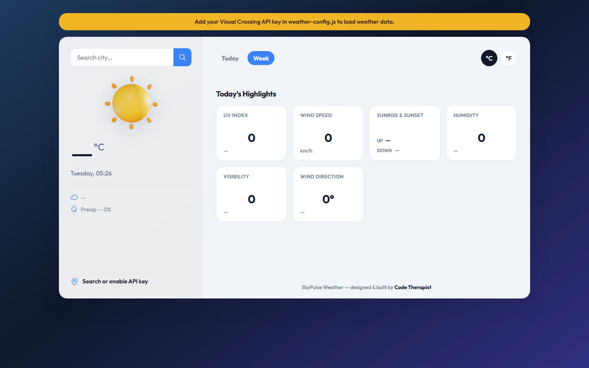
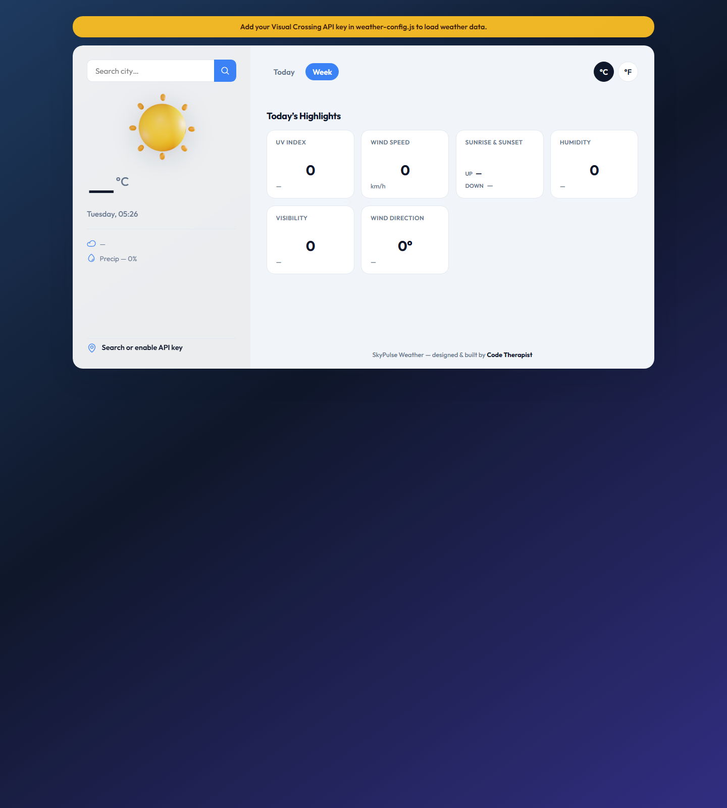
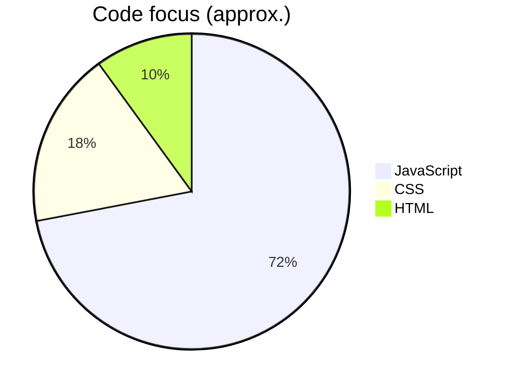
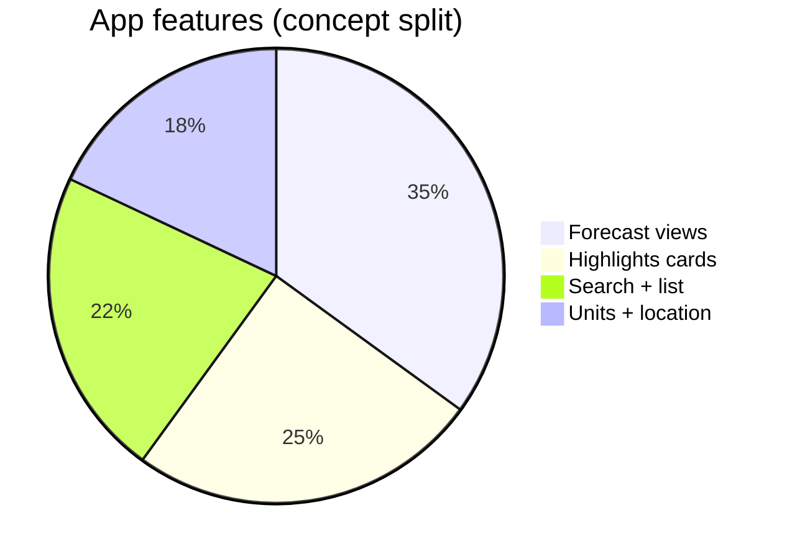
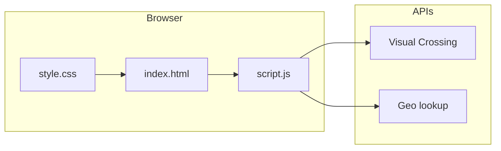
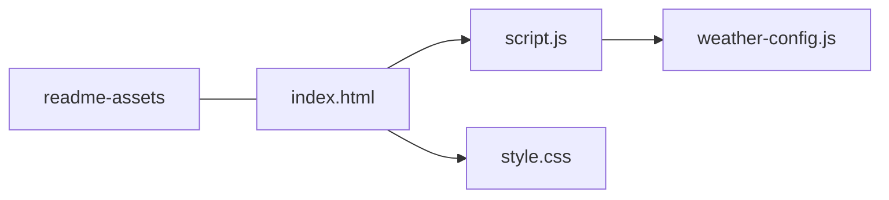

<div align="center">

# 🌤️ SkyPulse Weather

[](https://codetherapistpita-oss.github.io/wetherapp-frontend-/)
[](LICENSE.md)
[](https://www.visualcrossing.com/weather-api/)


<br/>


<sub>Icons via <a href="https://skillicons.dev">skillicons.dev</a> · Typing line via <a href="https://github.com/DenverCoder1/readme-typing-svg">readme-typing-svg</a></sub>

<br/>

### 🔗 Open the live site (GitHub Pages)

**👉 [https://codetherapistpita-oss.github.io/wetherapp-frontend-/](https://codetherapistpita-oss.github.io/wetherapp-frontend-/)**

*Click the URL above to open SkyPulse Weather in your browser. Add your API key in `weather-config.js` for live weather data.*

</div>

---

## 👀 Preview

*Click a screenshot to open the **[live app](https://codetherapistpita-oss.github.io/wetherapp-frontend-/)**.*

| | |
|:---:|:---:|
| <a href="https://codetherapistpita-oss.github.io/wetherapp-frontend-/"></a> | <a href="https://codetherapistpita-oss.github.io/wetherapp-frontend-/"></a> |
| **Dashboard** | **Highlights & cards** |

---

## 📊 At a glance







---

## ✨ Features (quick)

| | |
|--|--|
| 📱 | **Responsive** sidebar + main panel |
| 🔎 | **City search** + bundled autocomplete list |
| ⏰ | **Today** (hourly) / **Week** toggle |
| 🌡️ | **°C** / **°F** switch |
| 🧭 | **Wind direction** (° + compass) — not fake “AQI” |
| 🔑 | **API key** in `weather-config.js` only (no keys in `script.js`) |
| ⚠️ | **Banner** if key missing or request fails |

---

## 🛠️ Stack

|  |  |  |  |
|:---:|:---:|:---:|:---:|
| Structure | Variables · flex · grid | `fetch` · DOM | Timeline weather |

<p align="center">


</p>

---

## 🚀 Setup

<details>
<summary><b>1 · Clone</b></summary>

```bash
git clone https://github.com/codetherapistpita-oss/wetherapp-frontend-.git
cd wetherapp-frontend-
```

</details>

<details>
<summary><b>2 · API key → <code>weather-config.js</code></b></summary>

```javascript
window.WEATHER_VC_KEY = "YOUR_KEY_HERE";
```

Free key: [visualcrossing.com/weather-api](https://www.visualcrossing.com/weather-api/)

</details>

<details>
<summary><b>3 · Run locally</b></summary>

```bash
npx serve .
```

</details>

<details>
<summary><b>4 · GitHub Pages</b></summary>

**Settings → Pages →** branch `main` / root → then open the **Live demo** badge at the top.

</details>

---

## 📁 Files



---

## 🙏 Credits

| | |
|--|--|
| **SkyPulse** | UI refresh, API safety, docs — **Code Therapist** |
| **WeatherVista** | Original app — [wasimtikki120/WeatherVista…](https://github.com/wasimtikki120/WeatherVista-Interactive-Weather-App) · MIT |

---

## 👤 Code Therapist

<p align="center">

[](https://github.com/codetherapistpita-oss)
[](https://codetherapistpita-oss.github.io/codetherapist-portfolio/)
[](https://www.linkedin.com/in/code-therapist-1142243b5)

</p>

<sub>In-app footer: name only · no links (fork-friendly).</sub>

---

<div align="center">

**[🌐 Open live site](https://codetherapistpita-oss.github.io/wetherapp-frontend-/)** · **⭐ Star the repo** if this helped · PRs welcome · keep API keys out of git

</div>
